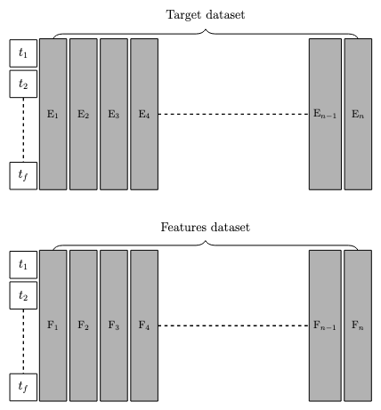

# Ensemble Ocean Waves Prediction
A package to use deep learning to predict oceanography variables from historical data.

## Technical explanation of the code

Better predictions of ocean waves conditions are essential for a handful of industries that define its operations based on the outcome of these analysis. Almost all engineering applications that happens in the ocean, from transportation to renewable energies, going across offshore platforms and alerts of catastrophic events, not to mention geosciences research benefits from an accurate description of sea state.

This package develop a forecast of significant ocean wave height using an ensemble technique of five different neural networks (NN), namely, **LSTM, CNN, CNN-LSTM, MLP** and **RNN**. The yielded result is a arithmetic mean of the outcome of each NN. 

The main goal of the methodology developed is to be used as a surrogate to traditional numerical models. The data used for training can be other models forecasts, reanalysis data or any dataset that provide the variable as a historic data series. It is also needed the real buoy observed data, to create the training and test datasets. In this framework, we build a features dataset, in which each column have a time series of NOAA forecast for a specific lead time. First column have data from 3 hour lead forecasts of H_s, column two, 6 hour lead forecasts, and so on until the n-th column. Each row of this dataset represents a date and time, and its lenght define the size of the training phase. For the target dataset, i.e., each element (i,j) will be the residue between NOAA forecast in the features dataset at position (i,j) and the real measured data obtained from the buoy at that date and time. The predictions of the neural network will be of one row and $n$ columns, in the time position just after the last row of the target dataset. Thus, the network will have predicted the residue, and considering each of the lead time of the columns, as it was constructed in the features dataset. The figure below illustrates target and features dataset.



## Data

To run this project, two sets of data are needed: model forecast (or similar) and buoy data.
Add buoy data to ``/data/raw/buoy`` and forecast to  ``/data/raw/``.

## Installation

Clone the repository, create an environment and in a terminal, in the folder you downloaded the repo, run:

```sh
pip install -e ./ensemble-wave-prediction
```
## Usage

There are three modules created in the project: ``create_data``, ``train_models``, ``generate_graph``. To check them, run

```sh
wave_ensemble --help
```

This command allows to see the names and alias for using each module. To check the required commands for each module, run

```sh
wave_ensemble create_data --help
wave_ensemble train_models --help
wave_ensemble generate_graph --help
```

A full pipeline uses ``create_data`` that takes data from ``raw`` folder and generates target and features dataset, that can be saved in ``./data/processed/``. The module ``train_models`` takes the processed data and generates the results, that can be saved in ``./data/result/``. To visualize data, just run ``generate_graph``.

To run each module, just type ``wave_ensemble`` +  ``module_name`` + ``alias``.
For instance, to generate the target and features dataset, we run:

```sh
wave_ensemble create_data -o ./data/raw/noaa/ -d ./data/raw/processed -b ./data/raw/buoy/buoy_historic_santos.csv -n 'santos' -l 8 
```

This will create an eight (or any integer inputed in -l) days forecast. To train and run forecast, we run:

```sh
wave_ensemble train-models -o ./data/processed/ -d ./data/result/
```

To plot the results, we run:

```sh
wave_ensemble generate-graph -d ./data/result/
```

## Meta

This lib is used in the paper: TBD. Please cite this when using it.

This project is licensed under the terms of the GNU General Public License. See ``LICENSE`` for more information.

[https://github.com/felipeminuzzi/ensemble-wave-prediction](https://github.com/felipeminuzzi/ensemble-wave-prediction)


